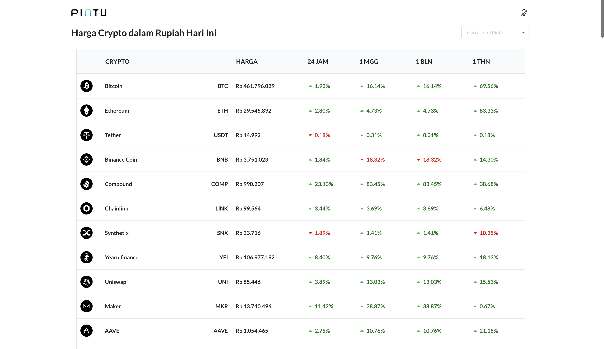
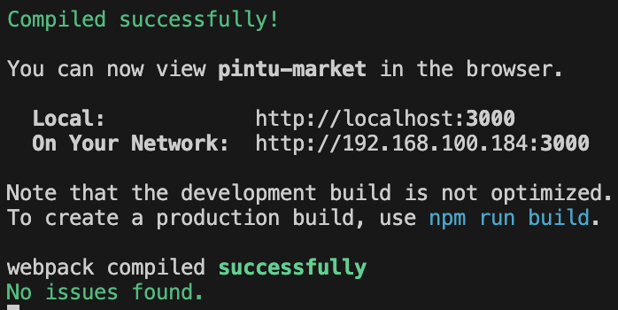
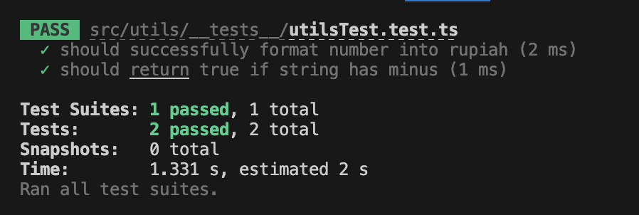
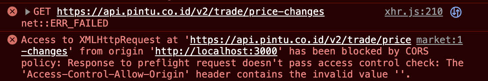

# pintu-market
pintu-market is a frontend websites that replicate https://pintu.co.id/market page. You can access pintu-market website on https://pintu-market.vercel.app/. This app is designed with React and Typescript, while deployed in vercel with auto deployment.



Functions on the website :
- Token List to show tokens with responsive design
- Price for token will change every 5 seconds (refetch api)
- Search token to open the token detail page
- you can find other functions in the [app](https://pintu-market.vercel.app/)

## How to run the code

1. Clone this repository `git clone git@github.com:JovanKaruna/pintu-market.git`
2. In the root project directory, run `npm install` to install all the dependencies
3. Copy the `.env.example` file into `.env` file in the root project directory and then change the `"YOUR API END POINT GOES HERE"` with your API end point (we will use `https://pintu-app.vercel.app`)
```
REACT_APP_API_END_POINT=https://pintu-app.vercel.app
```
4. Then run `npm start` to run and compile the code, then you can open the localhost:port in your web browser

5. You can also run `npm test` to run the unit tests


## Requirement and Bonus
* Replicate page https://pintu.co.id/market
* Using React 16+ and Typescript 
* Used hooks and context for state management (context for light/dark theme)
* Used react-query
* Used ESLint for linting
* This project is using Automated deployment in vercel
* Using tailwindcss for modular CSS and the website is responsive
* Create unit tests for utils
* Using some animations from gif and CSS (loader)
* Documentation in README.md

## Improvement
Some of the improvement opportunities I can think of for the market page functionality other than add tag filtering, sorting, top movers (24 hours) which I haven't add for my app, is to add top volume traded for tokens in 24 hours if there are API which supports that function. 
Other improvement for my app is to add more tests for the app until it has a good coverage and to used the API provided since the price changes should be real time, meanwhile my API is not real time.

## Problems
The api given in the assignment has a problem with the cors preflight and cannot be accessed from website here is the screenshot of the error

my solution for this error is to mock the API by creating a new backend app and deploy the app (`https://pintu-app.vercel.app`) and then using it as my API endpoint.


## Dependencies
Some of the dependencies that are used in this project
```
- React
- Typescript 
- React Query
- ESLint
- Axios
- Tailwind
- react router dom
- react query
- semantic ui react
```

## Folder Structure
```
       └── src
           ├── assets
           ├── components
           ├── contexts    
           ├── pages    
           ├── services
           └── utils  
```

## Contributors
This project is created by :
- [Jovan Karuna Cahyadi](https://www.linkedin.com/in/jovan-karuna-cahyadi/).